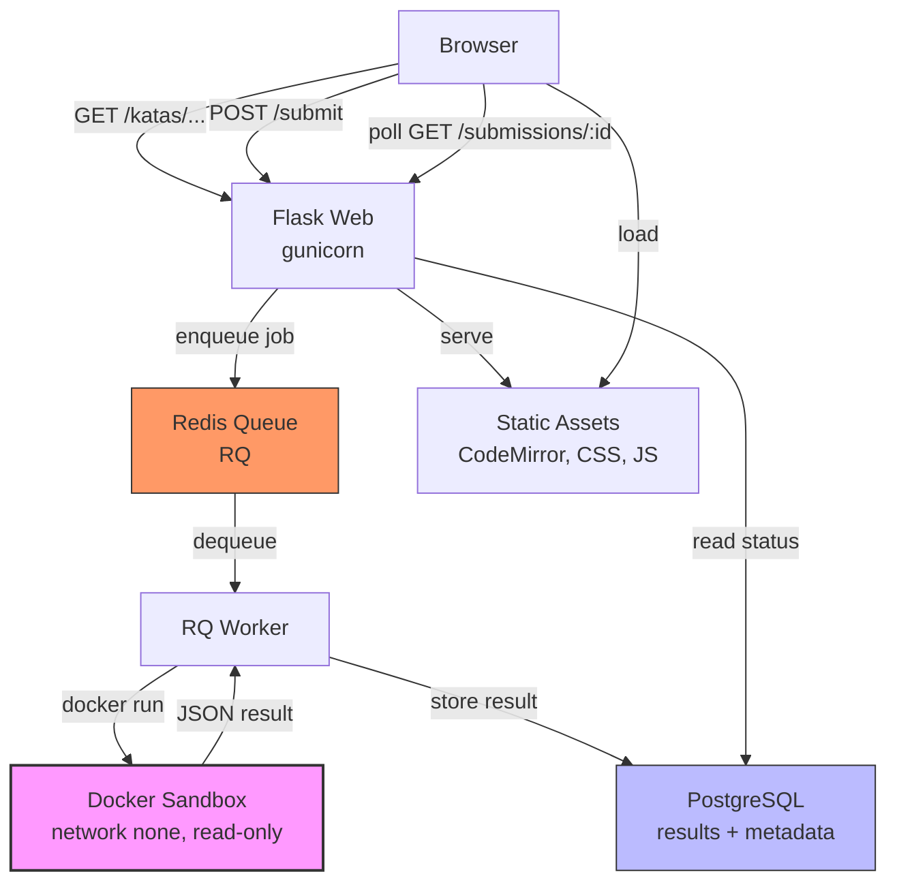

# Mini Online Judge Platform

[](https://github.com/dfmarin/pykatas/actions/workflows/ci.yml)
[](https://github.com/dfmarin/pykatas/actions/workflows/docker.yml)
[](https://codecov.io/gh/dfmarin/pykatas)
[](https://www.python.org/downloads/)
[](https://github.com/astral-sh/ruff)

This project demonstrates how to build a safe, scalable online judge from the ground up – not just as a prototype, but as a system ready for continuous delivery, observability, and real‑world deployment. It’s a showcase of **backend engineering**, **DevEx tooling**, and **infrastructure as code**.

## Key Features

- **Secure code execution** – Every user submission runs inside an isolated, read‑only Docker sandbox with `--network none`, strict memory/CPU caps, and a non‑root user.
- **Async job queue** – Submissions are enqueued via **Redis + RQ**; the web server never touches user code.
- **Rich feedback** – Structured test results (pytest‑json), Ruff linting, execution metrics, and cleaned tracebacks.
- **Katas as filesystem assets** – Each kata is a version‑controlled directory: `kata.yaml`, starter code, public/hidden tests, and a README.
- **Full CI/CD pipeline** – Lint, unit/integration tests, sandbox image build, and multi‑stage Docker image pushed to GHCR on every merge to `main`.
- **DevEx first** – Ruff (lint+format), pre‑commit hooks, Makefile shortcuts, and a single `pyproject.toml` for all tooling.

## DevOps & Platform Engineering Highlights

This project was built to reflect real‑world engineering discipline. The following practices are baked in:

| Area | Implementation |
|------|----------------|
| **Containerization** | Multi‑stage `Dockerfile` for the web app; sandbox Docker image with `--read-only`, `--tmpfs`, and resource limits. |
| **CI/CD** | GitHub Actions workflows: `ci.yml` (lint + test + sandbox build) and `docker.yml` (build & push to GHCR). |
| **Test automation** | Pytest with markers (`unit`, `integration`, `e2e`), coverage thresholds (80%), and `factory-boy` fixtures. |
| **Infrastructure as Code** | `docker-compose.yml` defines the full dev stack (web, worker, Redis, Postgres). Production uses the same images. |
| **Observability** | Structured JSON logging, health check endpoint (`/healthz`), and RQ job telemetry. |
| **Secret management** | No secrets in code – env‑var driven with `.env.example` and runtime injection. |
| **Secure by design** | Sandbox: `--network none`, `--memory`, `--pids-limit`. Flask: CSRF, secure cookies, rate limiting, and user‑owned submissions. |
| **Developer Experience** | `Makefile` shortcuts (`up`, `test`, `lint`), pre‑commit hooks, and `pyproject.toml` as the single source of truth. |

## Architecture at a Glance



- **Web service** – Handles UI, authentication, and API. Never executes user code.
- **Worker service** – Runs the sandbox container and stores results.
- **Sandbox image** – Minimal Python + pytest + ruff. User code is mounted, not baked.
- **PostgreSQL** – Stores users, submissions, and structured feedback (`JSONB`).
- **Redis** – Backs RQ queues and ephemeral job state.

## Tech Stack

| Layer       | Technologies |
|-------------|--------------|
| Backend     | Python 3.13, Flask, SQLAlchemy, Flask‑Login |
| Queue       | Redis, RQ |
| Database    | PostgreSQL 16 (JSONB, full‑text search ready) |
| Container   | Docker (sandbox) + Docker Compose (dev) |
| Testing     | pytest, pytest‑cov, factory‑boy |
| Linting / Formatting | Ruff, pre‑commit |
| Frontend    | Jinja2, CodeMirror 5, marked.js, vanilla JS |
| CI/CD       | GitHub Actions, GHCR, Codecov |

## Getting Started

### Prerequisites
- Docker & Docker Compose (or Docker Desktop)
- GNU Make
- Python 3.13 (for local development without containers – optional)
- Python dependencies installed via `pip install -e .` (includes `markdown` for server-side README rendering)

### Quick Start (with Docker Compose)

```bash
# Clone the repository
git clone https://github.com/dfmarin/pykatas.git
cd pykatas

# Copy environment variables
cp .env.example .env

# Build and start all services
make up

# Run database migrations
make migrate

# Build the sandbox image (once)
make sandbox-build
```

Visit [http://localhost:5000](http://localhost:5000). Register an account and solve any of the four python katas provided.

**Try the full pipeline:**  

* `make test` → runs unit + integration tests (requires Postgres/Redis).  
* `make lint` → runs Ruff.  
* `make worker` → starts an RQ worker manually (if not using Docker Compose).

## Project Structure (Selected)

```text
pykatas/
├── .github/workflows/        # CI/CD pipelines
│   ├── ci.yml                # lint, test, sandbox build
│   └── docker.yml            # multi‑arch Docker build + push
├── app/
│   ├── services/             # kata_loader, docker_runner, feedback_parser
│   ├── workers/              # RQ job: execute_submission
│   └── web/                  # routes, forms, templates
├── katas/                    # each kata is a self‑contained folder
│   ├── nth_letter
│   │   ├── README.md
│   │   ├── kata.yml
│   │   ├── reference_solution.py
│   │   ├── starter_code.py
│   │   └── tests
│   │       ├── test_hidden.py
│   │       └── test_public.py
│   ├── shopping_total
│   │   ├── README.md
│   │   ├── kata.yml
│   │   ├── reference_solution.py
│   │   ├── starter_code.py
│   │   └── tests
│   │       ├── test_hidden.py
│   │       └── test_public.py
│   ├── simple_dictionary
│   │   ├── README.md
│   │   ├── kata.yml
│   │   ├── reference_solution.py
│   │   ├── starter_code.py
│   │   └── tests
│   │       ├── test_hidden.py
│   │       └── test_public.py
│   └── two_sum
│       ├── README.md
│       ├── kata.yml
│       ├── reference_solution.py
│       ├── starter_code.py
│       └── tests
│           ├── test_hidden.py
│           └── test_public.py
├── sandbox/                  # isolated execution environment
│   ├── Dockerfile            # multi‑stage, non‑root user
│   ├── runner.py             # entrypoint: runs ruff + pytest, emits JSON
│   └── requirements.txt
├── tests/                    # pytest suites (unit, integration, e2e)
├── docker-compose.yml        # dev stack (web, worker, db, redis)
├── Dockerfile                # multi‑stage production image for web+worker
├── pyproject.toml            # single source of truth for all tools
└── Makefile                  # common dev shortcuts
```

## Security in Production

Before deploying to a live environment, **must** review:

- [ ] `SECRET_KEY` is a strong random string (not the dev default)
- [ ] `DATABASE_URL` points to a managed, encrypted database
- [ ] `SANDBOX_IMAGE` uses a content hash (not `latest`)
- [ ] Docker socket is **not** mounted in the web container
- [ ] Rate limiting is enabled (e.g., `flask-limiter` on `/submit`)
- [ ] All forms have CSRF protection (enabled in production config)
- [ ] `SESSION_COOKIE_SECURE = True`, `SESSION_COOKIE_HTTPONLY = True`, `SESSION_COOKIE_SAMESITE = 'Lax'`
- [ ] A content security policy (CSP) restricts script sources

## Testing & Quality Gates

| Gate | Trigger | Tool |
|------|---------|------|
| Linting & formatting | `pre-commit`, GitHub Actions | Ruff |
| Unit tests (fast) | `pre-push` hook, CI | pytest (marker `unit`) |
| Integration tests | CI (on every push) | pytest (marker `integration`) |
| Coverage check | CI | `--cov-fail-under=80` |
| Sandbox image build | CI | Docker build |
| End‑to‑end (optional) | Manual or nightly | full stack compose |

## Acknowledgments

Built as a reference architecture for:
- **Backend engineering** – service layer pattern, async workers, DB modelling.
- **Secure execution** – Docker sandboxing with defence in depth.
- **DevEx tooling** – Ruff, pre‑commit, pyproject.toml, Makefile.
- **CI/CD discipline** – GitHub Actions, multi‑stage builds, artifact promotion.

